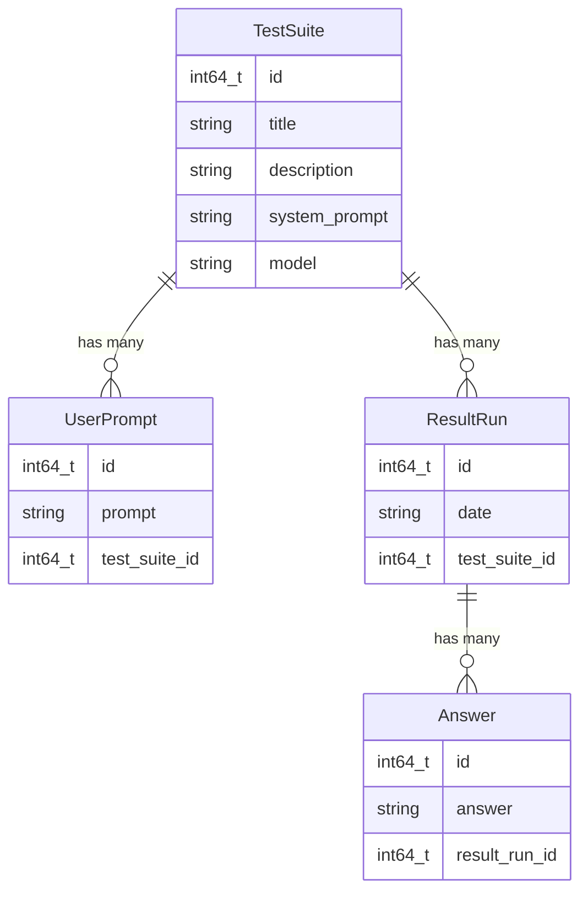

# Prompt Workbench

## Entity-Relationship Diagram

```mermaid
erDiagram
    TestSuite {
        int64_t id
        string title
        string description
        string system_prompt
        string model
    }

    UserPrompt {
        int64_t id
        string prompt
        int64_t test_suite_id
    }

    ResultRun {
        int64_t id
        string date
        int64_t test_suite_id
    }

    Answer {
        int64_t id
        string answer
        int64_t result_run_id
    }

    %% Relationships
    TestSuite ||--o{ UserPrompt : "has many"
    TestSuite ||--o{ ResultRun : "has many"
    ResultRun ||--o{ Answer : "has many"
```
