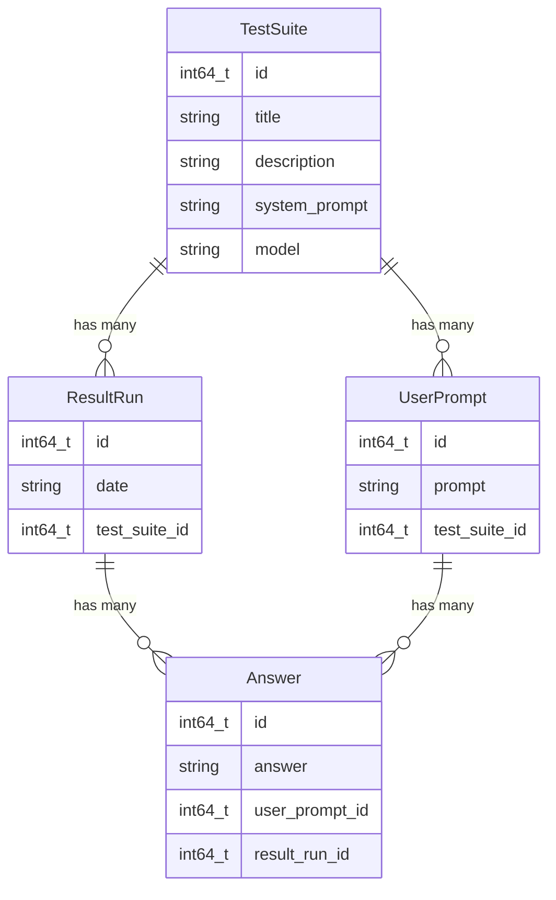

# Prompt Workbench

## Building and Running from Source

### 1. Prerequisites

Ensure you have a C++ compiler and CMake installed.

### 2. Install Dependencies

Before building, you must install the system libraries for GUI, Networking, and Database support.

#### **RHEL**

RHEL requires the **CodeReady Builder** (CRB) repository to find development headers.

```bash
# Enable the necessary repositories (EPEL and CodeReady Builder)
sudo subscription-manager repos --enable codeready-builder-for-rhel-$(rpm -E %rhel)-$(arch)-rpms
sudo dnf install https://dl.fedoraproject.org/pub/epel/epel-release-latest-$(rpm -E %rhel).noarch.rpm

# Install dependencies
sudo dnf install cmake gcc-c++ make meson ninja-build \
    wayland-devel wayland-protocols-devel libxkbcommon-devel \
    libXi-devel libXcursor-devel libXrandr-devel libXinerama-devel \
    mesa-libGL-devel sqlite-devel libunistring-devel openssl-devel
```

#### **Fedora**

```bash
sudo dnf install cmake gcc-c++ make meson ninja-build \
    wayland-devel wayland-protocols-devel libxkbcommon-devel \
    libXi-devel libXcursor-devel libXrandr-devel libXinerama-devel \
    mesa-libGL-devel sqlite-devel libunistring-devel openssl-devel
```

#### **Debian / Ubuntu**

Debian-based systems use the `-dev` suffix instead of `-devel`.

```bash
sudo apt update
sudo apt install build-essential cmake meson ninja-build \
    libwayland-dev wayland-protocols libxkbcommon-dev \
    libxi-dev libxcursor-dev libxrandr-dev libxinerama-dev \
    libgl1-mesa-dev libsqlite3-dev libunistring-dev libssl-dev
```

---

### 3. Build the Project

If you cloned the repository without submodules, initialize them first:

```bash
git submodule update --init --recursive
```

Create a build folder

```bash
mkdir build
```

You can use the `build.sh` script to compile and `run.sh` script to compile and run.

```bash
./build.sh
```

```bash
./run.sh
```

## Entity-Relationship Diagram


